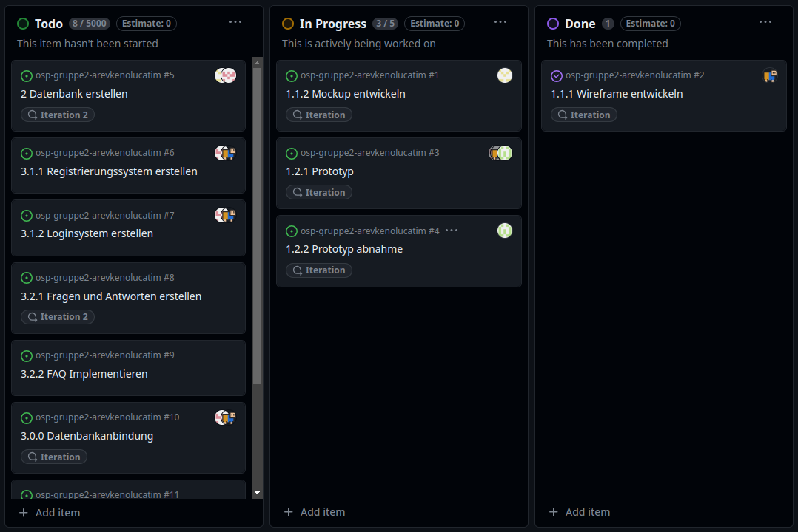

# Protkoll 02.02.2024

## Anwesenheit

- Alle Teilnehmer anwesend

## Projektcontrolling

- Aufsetzen der Projektstruktur
- Kanban-Board aufgesetzt
- Issues aufgesetzt

### Bezug zu Gantt

Arbeitspakete erledigt:

- 1.1.1 Wireframe entwickeln (Zeit: 1h)
- 1.1.2 Mockup entwickeln (Zeit: 3h)
- 1.2.1 Prototyp entwickeln (Zeit: 4h)

Auf nächste Iteration verschoben:

- 1.2.2 Prototyp auf Anforderungen prüfen

Grund: Zeit 

## Technisch

- Wireframes entwickeln
- Prototypen entwickeln
- Projekt aufgesetzt

## Doku

