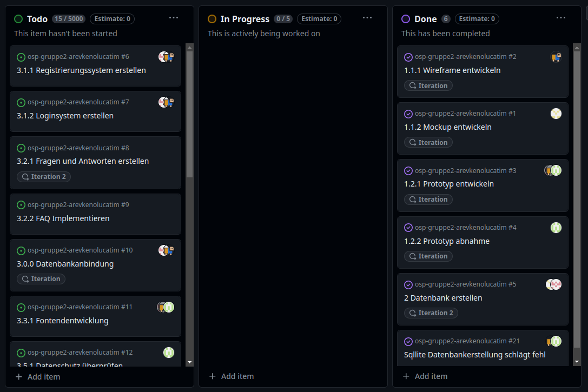

# Protkoll 16.02.2024

## Anwesenheit

- Alle Teilnehmer anwesend

## Projektcontrolling

Abnahme des ersten Prototyps:
- Kann Kriterium: Mobile Ansicht
- Wording bei Bestätigung
- Ausblenden von Feldern, bspw. bei nur Vortrag
- Styling

### Bezug zu Gantt

Arbeitspakete erledigt:

- 1.2.2 Prototyp auf Anforderungen prüfen (Zeit: 15min)
- 2 Datenbank erstellen (Zeit: 4h)

Auf nächste Iteration verschoben:

- /

Grund: /

## Technisch

-

## Doku

